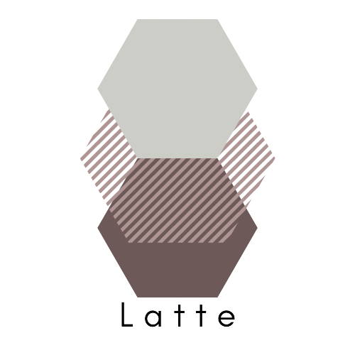

Latte: Cross-framework Python Package for Evaluation of Latent-based Generative Models
======================================================================================

Latte (for LATent Tensor Evaluation) is a cross-framework Python package for evaluation of latent-based generative models. Latte supports calculation of disentanglement and controllability metrics in both PyTorch (via TorchMetrics) and TensorFlow.

.. toctree::
   :maxdepth: 2
   :caption: Contents:
   :glob:

   ../README.md
   autoapi/latte/functional/*
   autoapi/latte/metrics/*

Indices and tables
==================

* :ref:`genindex`
* :ref:`modindex`
* :ref:`search`
